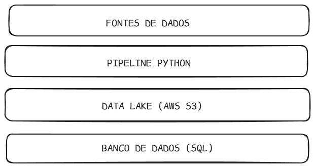

# pipeline-monitoramento-hardware
Pipeline de Engenharia de Dados para monitoramento de preços de hardware (GPUs e CPUs) com Python, AWS S3 e SQL.

# 🚀 Hardware de monitoramento de pipeline

Pipeline de Engenharia de Dados para monitoramento de preços de hardware (GPUs e CPUs) com Python e SQL.

## 🎯 Objetivo do Projeto
Este projeto demonstra um fluxo de Engenharia de Dados para monitorar a variação de preços de componentes de hardware. O objetivo é extrair dados via Web Scraping, tratá-los com Python e organizá-los em uma estrutura de Data Lake simplificada.

---

## 🛠️ Tecnologias Utilizadas

* *Linguagem:* Python (Pandas, Re, Logging)
* *Armazenamento:* Estrutura de pastas (Bronze/Silver/Gold) simulando AWS S3
* *Banco de Dados:* SQL para queries analíticas
* *Documentação:* Markdown e Excalidraw para arquitetura

---

## 📐 Arquitetura do Projeto

> *Fluxo de Dados:* Python Scraper ➡️ Camada Bronze (Raw) ➡️ Pandas Transformação ➡️ Camada Silver (Trusted) ➡️ SQL Analytics



---

## 💻 Demonstração Técnica (Python)
Abaixo, um trecho do pipeline que desenvolvi utilizando Programação Orientada a Objetos e a biblioteca Pandas para limpeza dos dados:

```python
def transform_data(self):
    df = pd.DataFrame(self.raw_data)
    
    # Limpeza de Preço com Regex (R$ 1.500,00 -> 1500.00)
    df['price_numeric'] = df['price'].apply(lambda x: float(re.sub(r'[R\$\s\.]', '', x).replace(',', '.')))
    
    # Categorização Automática de Hardware
    df['category'] = df['item'].apply(lambda x: 'GPU' if 'GPU' in x else 'CPU')
    
    return df

```sql
SELECT
    produto_nome,
    MIN(preco) AS menor_preco,
    MAX(preco) AS maior_preco,
    ROUND(((MAX(preco) - MIN(preco)) / MAX(preco)) * 100, 2) AS variacao_percentual
FROM hardware_prices
GROUP BY produto_nome
ORDER BY variacao_percentual DESC;

```
📫 Contato
  LinkedIn: www.linkedin.com/in/yasmim-loppes/  
  Email: yasmim_loppes@icloud.com
  GitHub: www.github.com/yasmimloppes    
